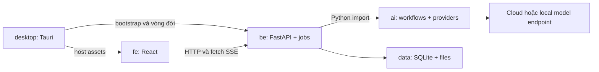

# Cấu trúc thư mục FE, BE, AI cho WriteStoryApp

Ngày: 02/10/2026. Trạng thái: thiết kế để triển khai; chưa tạo source skeleton, chưa build ứng dụng.

Đề xuất: một repository với ba thư mục ngang hàng `fe/`, `be/`, `ai/`; thêm `desktop/` cho Tauri và `data/` cho dữ liệu cá nhân. BE và AI là hai package Python riêng, dùng chung môi trường và chạy trong cùng backend process. FE gọi BE qua API; BE gọi AI bằng Python import.

**Trạng thái đối chiếu nguồn (02/10/2026):** đã kiểm tra cấu trúc InkOS tại máy và đã đọc lại các trang chính thức liên quan tới quyết định runtime (Tauri sidecar/resources, FastAPI background tasks/SSE, SQLAlchemy asyncio, SQLite WAL/FTS5/backup, uv workspaces). Kết quả và URL tại [review-and-optimization.vi.md §7](./review-and-optimization.vi.md). Các trang chỉ mang tính quy ước (React, Vite, PyPA, pnpm, PEP 8, Alembic) không ảnh hưởng quyết định nên chưa đọc lại từng trang.

Không có một tiêu chuẩn chính thức duy nhất quy định toàn bộ thư mục của mọi dự án React/FastAPI/AI. Cần phân biệt quy ước do công cụ hỗ trợ, hướng dẫn thiết kế của cộng đồng và quyết định riêng của dự án. Tách thư mục giúp quản lý code; hiệu năng thực tế phụ thuộc async, truy vấn, concurrency, editor và cách đóng gói.

## 1. Quyết định kiến trúc

| Khu vực | Cách tổ chức | Trách nhiệm |
|---|---|---|
| `fe/` | React/TypeScript, nhóm theo tính năng | Màn hình, editor, cache API, progress và tương tác người dùng |
| `be/` | Python `src` layout, nhóm theo nghiệp vụ, hạ tầng dùng chung | HTTP API, dữ liệu chuẩn, transaction, jobs, backup và settings |
| `ai/` | Python `src` layout, package độc lập | Provider adapters, context, prompt, workflow và output có schema |
| `desktop/` | Tauri với `src-tauri/` theo scaffold | Cửa sổ, bootstrap, vòng đời backend và data-root |
| `contracts/` | Snapshot giao thức sinh từ BE | OpenAPI và ví dụ payload/event; không chứa bản khai báo types viết tay trùng lặp |
| `data/` | Runtime có thể di chuyển | SQLite, asset, import/export, backup, log và vault |

FE tổ chức theo tính năng là lựa chọn cho dự án, không phải quy định bắt buộc của React. BE dùng module nghiệp vụ để không gom 146 hạng mục vào một thư mục `services/` khổng lồ. AI có API Python rõ ràng để thay provider và kiểm tra workflow mà không cần khởi động FastAPI.

## 2. Nguồn chính thức để đối chiếu

Các mô tả bên dưới nêu phạm vi của nguồn và quyết định dự kiến. Đã xác minh: Tauri sidecar/resources, FastAPI (BackgroundTasks, SSE native từ 0.135), SQLAlchemy asyncio, SQLite WAL, uv workspaces. Các nguồn còn lại là hướng dẫn quy ước, đọc lại khi dựng skeleton.

| Nguồn | Nội dung cần đối chiếu | Áp dụng dự kiến, không mở rộng thành tuyên bố về tiêu chuẩn |
|---|---|---|
| [React: Thinking in React](https://react.dev/learn/thinking-in-react) | Phân rã UI thành component, ownership của state | Component theo trách nhiệm; React không bắt buộc cây `features/` ở đây |
| [Vite: Getting Started](https://vite.dev/guide/) | Scaffold và build React/TypeScript | `index.html`, `src/`, `vite.config.ts` trong `fe/` |
| [FastAPI: Bigger Applications](https://fastapi.tiangolo.com/tutorial/bigger-applications/) | `APIRouter`, module và dependency | Routes mỏng, đăng ký router theo nghiệp vụ; cây domain là lựa chọn của WriteStoryApp |
| [FastAPI: Concurrency and async/await](https://fastapi.tiangolo.com/async/) | Async cho I/O, khác biệt với parallel CPU work | Async provider; blocking/CPU work đưa sang worker phù hợp |
| [PyPA: src layout vs flat layout](https://packaging.python.org/en/latest/discussions/src-layout-vs-flat-layout/) | Phân biệt source package với thư mục repository | `be/src/writestory_be`, `ai/src/writestory_ai` |
| [PyPA: pyproject.toml](https://packaging.python.org/en/latest/guides/writing-pyproject-toml/) | Metadata, build system, dependencies | Mỗi package Python có manifest; dependencies đặt đúng package sở hữu |
| [uv: Workspaces](https://docs.astral.sh/uv/concepts/projects/workspaces/) | Local members, dependency và lockfile chung | BE phụ thuộc AI trong uv workspace; một `uv.lock` ở root |
| [pnpm: Workspaces](https://pnpm.io/workspaces) | Workspace JS và local package management | `fe` và `desktop` là workspace members; một lockfile JS ở root |
| [Tauri: Project Structure](https://v2.tauri.app/start/project-structure/) | Thư mục Rust, configuration và frontend assets | Rust trong `desktop/src-tauri`; FE ở workspace sibling |
| [Tauri: Embedding External Binaries](https://v2.tauri.app/develop/sidecar/) | Bundled executable, target triple và sidecar integration | Đóng gói backend theo OS/architecture; onedir/resources phải kiểm tra thực tế |
| [SQLAlchemy: AsyncIO extension](https://docs.sqlalchemy.org/en/20/orm/extensions/asyncio.html) | Async engine/session và concurrent tasks | Session riêng mỗi đơn vị công việc; không chia sẻ AsyncSession giữa tasks |
| [Alembic: Tutorial](https://alembic.sqlalchemy.org/en/latest/tutorial.html) | Migration environment và revision files | Migration nằm trong BE, không để trong `data/` |
| [SQLite: WAL](https://sqlite.org/wal.html) | WAL, readers/writer và checkpoint | SQLite vẫn có một writer; WAL không biến DB thành nhiều writer song song |
| [PEP 8](https://peps.python.org/pep-0008/) | Quy ước đặt tên và style Python | Package/module `snake_case`; không quy định kiến trúc AI |

Không viện dẫn các trang này để khẳng định pipeline viết truyện là chuẩn ngành. Thứ tự planner/writer/reviewer/settlement và ranh giới DB là thiết kế của dự án, dựa trên luồng đã rà soát trong InkOS.

### 2.1 Bằng chứng từ source InkOS đã đọc tại máy

- `E:/Inke/inkos/pnpm-workspace.yaml` khai báo `packages/*`; source tách `core`, `studio`, `cli`.
- `packages/studio/src/` có `api`, `components`, `pages`, `hooks`, `shared`, `store`, `lib`; API và UI cùng package Studio.
- `packages/studio/package.json` khai báo React, Vite, TypeScript và Hono; không phải backend FastAPI.
- `packages/core/src/` chứa `llm`, `prompts`, `pipeline`, `retrieval`, `state`, `harness`, `interactive-film`, `play`, `translation`, `skills` và các module khác.
- `packages/studio/vite.config.ts` có proxy API và cấu hình riêng cho SSE.

WriteStoryApp giữ phân chia nghiệp vụ và workflow của source tham khảo, chuyển BE/AI sang Python và tách UI/API rõ hơn. Các tài liệu/Skill trong source chỉ là nội dung tham khảo, không phải yêu cầu thực thi cho phiên làm việc này. Phạm vi 146 hạng mục và 26 luồng vẫn nằm trong kế hoạch chính.

## 3. Cây repository

Đây là cây **đích**, không phải danh sách thư mục đã tồn tại. Chỉ tạo module khi giai đoạn tương ứng cần dùng.

```text
WriteStoryApp/
  fe/                              React/TypeScript/Vite
    package.json
    index.html
    vite.config.ts
    tsconfig.json
    public/                        Tài nguyên tĩnh của UI
    src/
      main.tsx
      app/                         Khởi tạo, routes, providers, layout
      features/                    Tính năng UI theo nghiệp vụ
      shared/                      UI primitives, API transport, desktop bridge
      styles/
    tests/                         Setup và kiểm tra tích hợp UI
  be/                              Python package: writestory-be
    pyproject.toml
    alembic.ini
    migrations/
      env.py
      versions/
    src/writestory_be/
      __init__.py
      __main__.py                   Entry point của backend binary
      main.py                       App factory FastAPI
      bootstrap/                   Runtime, migrations, dependency wiring
      api/                         Auth, router registry, errors, SSE
      modules/                     Domain, service, API schema/router theo nghiệp vụ
      jobs/                        Supervisor, checkpoints, recovery, scheduling
      infrastructure/              SQLite, filesystem, vault, AI bridge
      core/                        Config/error/ID primitives dùng chung
    tests/
      unit/
      integration/
  ai/                              Python package: writestory-ai
    pyproject.toml
    src/writestory_ai/
      __init__.py
      contracts/                   Typed input/output, usage, stream events
      ports/                       Interface cho provider/context/progress
      providers/                   Async text/image/search adapters
      context/                     Retrieval policy, evidence, token budgets
      prompts/                     Templates/version manifest đóng gói cùng package
      methods/                     Registry/schema và built-in method documents
      workflows/                   Pipeline theo loại tác phẩm
      evaluators/                  Continuity, schema và quality checks
      policies/                    Retry, limits và model capability policy
    tests/
      unit/
      contract/
      fixtures/
  desktop/
    package.json                   Tauri CLI scripts, không chứa React source
    src-tauri/
      Cargo.toml
      Cargo.lock
      tauri.conf.json
      capabilities/
      icons/
      src/
        main.rs
        lib.rs
        backend.rs                 Spawn/readiness/shutdown
        data_root.rs               Resolve path, writable check, single-instance
      binaries/                    Generated sidecar entry, bỏ khỏi Git
      resources/                   Generated Python onedir resources, bỏ khỏi Git
  contracts/
    openapi.json                   Sinh từ BE, version trong Git
    examples/                      Ví dụ job/event/error không có secret
  tools/
    dev/                           Chạy dev bằng đường dẫn rõ, không phụ thuộc shell POSIX
    contracts/                     Export OpenAPI và sinh TS types
    packaging/                     PyInstaller spec, build/staging theo target
  tests/
    integration/                   BE + AI + DB với mock provider
    desktop/                       Smoke tests trên Windows/macOS
    fixtures/                      Truyện mẫu và dữ liệu test đã khử thông tin cá nhân
  docs/
    implementation-plan.vi.md
    folder-architecture.vi.md
    inkos-source-inventory.json
    adr/                           Decision records tạo khi bắt đầu triển khai
  data/                            Runtime cá nhân; không phải source code
  .github/workflows/               CI theo OS/architecture
  package.json                     Điều phối scripts cho JS workspace
  pnpm-workspace.yaml
  pnpm-lock.yaml
  pyproject.toml                   uv workspace, cấu hình Ruff/type checker dùng chung
  uv.lock
  .python-version                 Pin CPython sau spike
  .gitignore
```

`desktop/src-tauri/tauri.conf.json` dự kiến trỏ `frontendDist` tới `../../fe/dist` và `devUrl` tới Vite dev server. Đường dẫn phải được kiểm tra với scaffold Tauri dùng thực tế. Backend bundle không được suy ra đường dẫn từ current working directory.

## 4. FE: nhóm theo tính năng

```text
fe/src/
  app/
    App.tsx
    router.tsx
    providers.tsx                  Query client, theme, bootstrap session
    layouts/                       App shell, workspace panels
  features/
    library/
      api/                         Query/mutation dùng generated types
      components/
      hooks/
      pages/LibraryPage.tsx
      types.ts                     UI-only types
      index.ts                     Public exports
    editor/
      api/
      components/ChapterEditor.tsx
      extensions/                  Tiptap extensions
      hooks/useAutosave.ts
      model/                       Buffer, selection, unsaved state
      pages/EditorPage.tsx
      index.ts
    story_bible/                   Nền truyện, dàn ý sự kiện, nhân vật, hooks, timeline
    ai_workspace/                  CandidateStream, context trace, accept/reject
    continuity/                    Tab "Nối": handoff, seam check, banner bị chặn
    review/                        Findings, diff mức từ (Web Worker), lịch sử phiên bản
    writing_room/                  Phòng viết đa truyện: pipeline, hàng đợi, chi phí
    jobs/                          Event bus SSE toàn cục (/v1/events) phân phối theo workId, progress, cancel, reconnect
    onboarding/                    Lần chạy đầu: data-root, vault, provider, truyện đầu tiên
    notifications/                 Trung tâm thông báo, thông báo native
    storage/                       Dung lượng và dọn dẹp dữ liệu
    settings/                      Mô hình AI (tự lấy danh sách, danh sách model, effort), vai trò, vault, data-root
    ...                            Domain mới mở khi tới giai đoạn tương ứng
  shared/
    api/
      client.ts                    Authenticated HTTP client
      stream.ts                    Fetch/SSE parser, event cursor
      generated/schema.d.ts        Generated, không sửa tay
    desktop/bridge.ts              Tauri bootstrap/capabilities, có web-dev mock
    ui/                            Button, Dialog, Input, typography
    lib/                           Hàm nhỏ không có nghiệp vụ
  styles/global.css
```

- Hướng import: `app → features → shared`. `shared` không import `features` hoặc `app`.
- Một feature không đọc thư mục nội bộ của feature khác. Chia sẻ qua public export nhỏ; nếu phụ thuộc chéo nhiều, đưa logic dùng chung về module thích hợp hoặc phối hợp ở `app`.
- React component `PascalCase.tsx`; hooks `useSomething.ts`; utility/config `camelCase.ts` hoặc tên theo scaffold. Folder nghiệp vụ dùng `snake_case` nhất quán với BE/AI.
- TanStack Query giữ server state; Zustand giữ panel/selection/UI preferences tạm. Editor giữ buffer chưa lưu; SQLite mới là nguồn chuẩn sau save. Không sao chép toàn bộ database sang một global store.
- API DTO lấy từ BE OpenAPI. FE có thể tạo view model riêng để render, không tự viết lại DTO ở `types.ts`.
- Test gắn với component/hook khi hợp lý (`ChapterEditor.test.tsx`); test luồng nhiều màn hình ở `fe/tests/`. Không bắt mỗi thư mục phải có đủ `api`, `hooks`, `model` nếu chưa có nhu cầu.
- Route cấp ứng dụng lắp ghép feature pages. Không đặt toàn bộ nghiệp vụ vào `App.tsx`, cũng không đưa prompt/provider key vào FE.

## 5. BE: nghiệp vụ sở hữu use case, hạ tầng sở hữu I/O

Ví dụ một module khi đã có đủ chức năng:

```text
be/src/writestory_be/
  modules/
    chapters/
      router.py                    HTTP route và dependency injection
      schemas.py                   Request/response Pydantic, là API contract
      service.py                   Save, accept candidate, restore, expected_revision
      domain.py                    Quy tắc nội dung/revision, không gọi FastAPI
      ports.py                     Repository/context interfaces cần cho module
    works/
    materials/
    sessions/
    harness/                       Profiles, capabilities, action dispatch
    settings/
    ...
  jobs/
    supervisor.py
    runner.py
    recovery.py
    events.py
    scheduler.py                   Hàng đợi theo truyện, xoay vòng công bằng, cấp slot (R2)
    locks.py                       Khóa truyện có lease + heartbeat, xếp hàng (R2)
    cron.py                        Lịch chạy theo giờ, quota theo ngày (R7)
  infrastructure/
    db/
      engine.py
      models/                      ORM mappings theo domain
      repositories/                Triển khai module repository ports
      unit_of_work.py              Transaction boundary
      fts.py
    files/
      storage.py                   Data-root-relative asset references
      backup.py
      export.py
    secrets/vault.py
    ai/
      factory.py                   Tạo provider clients, inject limits/settings
      limits.py                    Limiter theo provider: concurrency, RPM/TPM, Retry-After, ngân sách
      discovery.py                 Lấy {base_url}/v1/models, chuẩn hóa, merge danh sách model
      model_resolver.py            Chọn model + effort theo vai trò/truyện, ghim vào job
      context_adapter.py           Đọc SQLite/FTS rồi chuyển sang AI ContextPort
      progress_adapter.py          Lưu AI progress/checkpoint thành job events
  api/
    router.py                      Include routers
    dependencies.py                Auth và per-request/service dependencies
    errors.py
    streams.py
```

Hướng gọi: `router → service → domain/ports`; infrastructure triển khai ports; bootstrap lắp ghép các implementation. Domain không import FastAPI, SQLAlchemy hay Tauri. Với CRUD đơn giản có thể gộp file trước; không cần tạo class/interface cho mỗi hàm.

BE chịu trách nhiệm SQLite, migration, canonical revision, work locks, job lifecycle và ghi asset. Routes chỉ validate request, gọi use case, đổi output/error thành HTTP. API sinh văn bản dài trả job ID; `jobs/runner.py` gọi AI ngoài vòng đời request.

Session SQLAlchemy không dùng chung cho các task đồng thời. Transaction đọc snapshot kết thúc trước khi gọi AI; transaction commit ngắn chỉ mở khi đã có output hợp lệ. Supervisor persist queued job trước khi chạy; khi restart phải reconcile jobs đang chạy, không chỉ nhớ task trong RAM.

`core/` chỉ chứa primitive thực sự dùng chung. Logic viết truyện nằm trong module phù hợp, không dồn vào `utils.py`, `helpers.py` hoặc một `service.py` toàn app.

## 6. AI: package độc lập, có input/output và ports rõ ràng

```text
ai/src/writestory_ai/
  contracts/
    generation.py                  GenerationInput, DraftCandidate, ProposedStateDelta
    state.py                       StoryState, StateDelta ops, evidence (implementation-plan §23.1.A)
    paragraphs.py                  Văn bản theo paragraph_id, ParagraphOps cho sửa cục bộ (§23.1.B)
    events.py                      TokenDelta, StepProgress, CheckpointPayload
    usage.py
  ports/
    provider.py                    TextProvider/ImageProvider/SearchProvider
    context.py                     ContextPort trả tài liệu có evidence/revision
    progress.py                    ProgressSink, CheckpointSink
  providers/
    openai_compatible.py           Adapter giao thức; capability phải kiểm chứng
    anthropic.py                   Chỉ tạo khi cần support
    ollama.py                      Local adapter khi triển khai
    registry.py
  context/
    builder.py
    retrieval.py                   Query/ranking policy, không chứa SQLite connection
    budget.py
    evidence.py
  prompts/                         Chỉ phần dùng chung không phụ thuộc ngôn ngữ (loader Jinja2 sandbox, render, manifest loader)
                                   Template và manifest theo ngôn ngữ nằm ở languages/<lang>/prompts/ (Plan §24 D38)
  methods/
    registry.py
    schemas.py
    builtin/                       Static method documents đóng gói
  workflows/
    longform/
      pipeline.py
      planner.py
      writer.py
      reviewer.py
      settlement.py
      handoff.py                   ending_state + tail_text cho chương kế tiếp
      summaries.py                 Tóm tắt chương / arc / synopsis phân tầng
      outline_review.py            Xét lại dàn ý mỗi K chương
      pacing.py                    Ngân sách sự kiện / chương còn lại, chống kết thúc sớm
      seam_check.py                Kiểm tra mối nối đoạn mở với ending_state chương trước
      repair.py                    Sửa cục bộ có giới hạn vòng
    short_fiction/
    translation/
    ...
  evaluators/
    continuity.py
    deterministic.py               Kiểm tra chung: tên riêng, nhân vật đã chết, lặp n-gram; gọi thêm check của gói ngôn ngữ
    structured_output.py
  languages/                       Gói ngôn ngữ, chọn theo works.language
    base.py                        Interface LanguagePack
    vi/                            Làm trước, gói duy nhất trong MVP
      normalizer.py                NFC, kiểu bỏ dấu, dấu câu/thoại
      length.py                    Đếm âm tiết
      search.py                    Bỏ dấu + đ→d cho cột FTS
      checks.py                    Xưng hô, lớp từ, chính tả, cụm sáo
      prompts/                     Prompt tiếng Việt theo vai trò
      methods/                     Phương pháp sáng tác tiếng Việt
      slop_list.txt, genres.json   Cụm sáo, preset thể loại
  policies/
    retry.py
    limits.py
```

- AI import Python/Pydantic/provider libs và code nội bộ AI; không import `writestory_be`, FastAPI, ORM model hoặc React.
- BE chuyển snapshot đã persist sang `GenerationInput`. AI trả candidate và proposed delta; BE validate revisions và quyết định commit. AI không tự ghi chương chuẩn vào SQLite.
- ContextPort cho phép AI yêu cầu thêm evidence; BE triển khai bằng FTS/repositories. Nếu cần scan PDF hoặc CPU worker, BE điều phối phần đọc/parse, AI nhận kết quả có provenance.
- Progress/checkpoint đi qua port callback được BE cung cấp. Payload có version, source revisions và pinned settings; không truyền ORM object hoặc DB session.
- Cơ chế retry transport do adapter/policy AI sở hữu; BE sở hữu retry/resume job. Có giới hạn tổng attempt, tránh retry lồng nhau làm nhân số lần gọi và chi phí.
- BE tạo/inject limiter dùng chung theo provider và client có vòng đời rõ; không tạo AsyncClient mới cho từng token/call. Mỗi job vẫn có cancellation/deadline và work lock ở BE.
- Prompt và built-in methods là package resources; đọc qua `importlib.resources`, khai báo inclusion trong build config và kiểm tra frozen bundle. Tài liệu method user import/chỉnh nằm trong `data/methods/`, có metadata/checksum trong DB.
- Unit/contract tests dùng mock provider. Live-provider tests chỉ chạy khi được cấu hình, kiểm tra capability và timeout; không gọi AI tốn phí trong test mặc định.

Package AI này có thể tái sử dụng cho CLI/evaluation sau này. Không cần một AI HTTP server, cổng thứ hai hoặc một database thứ hai trong bản desktop cá nhân.

## 7. Dependency, contracts và lockfiles



Mũi tên biểu diễn trách nhiệm runtime. AI cần context/progress thì dùng port do BE inject, không import ngược BE. Tách module không đồng nghĩa chạy ba server.

Root Python workspace dự kiến, **chỉ là mẫu cấu hình**:

```toml
[tool.uv.workspace]
members = ["be", "ai"]

[tool.uv.sources]
writestory-ai = { workspace = true }
```

`be/pyproject.toml` khai báo dependency `writestory-ai` và FastAPI/SQLAlchemy; `ai/pyproject.toml` khai báo Pydantic/httpx/provider SDK thực sự dùng. Mỗi package có `[build-system]` và version. Root workspace không bắt buộc trở thành một Python package. `uv.lock` dùng chung, không tạo thêm lockfile trong `be/ai`. Cả hai thống nhất `requires-python` với CPython 3.14 baseline (bản GIL tiêu chuẩn); `.python-version` và bản dependency cụ thể chốt sau R0.

JS workspace dự kiến:

```yaml
packages:
  - fe
  - desktop
```

`fe/package.json` sở hữu React/Vite/editor. `desktop/package.json` sở hữu Tauri CLI. Root package điều phối scripts; dùng một `pnpm-lock.yaml`, không trộn npm/yarn lockfiles. Cargo có lockfile riêng cho Rust; lockfile không phải dữ liệu người dùng.

Chuỗi sinh hợp đồng: `BE Pydantic/router schemas → contracts/openapi.json → fe/src/shared/api/generated/schema.d.ts`. Có thể dùng `openapi-typescript`; request/stream transport do `shared/api` quản lý. Generated file có banner và không sửa tay. CI export lại và kiểm tra diff khi schema thay đổi.

OpenAPI generation phải dùng app factory không mở vault, không migrate DB và không khởi động jobs. Các side effect chỉ chạy trong runtime lifespan/bootstrap. SSE event envelope là Pydantic schema có version; export qua endpoint/schema explicit để FE không phải đoán event types từ text mô tả.

Đóng gói Python cài cả BE/AI vào cùng môi trường build trước PyInstaller; khai báo hidden imports/resource collection cho dynamic provider registry và templates. Thử binary trên máy sạch, không dựa vào editable install để kết luận bundle hoạt động.

## 8. Luồng ví dụ: AI viết một chương

1. `fe/features/ai_workspace` gửi yêu cầu với work ID, instruction, expected revision và idempotency key.
2. `be/modules/chapters/router.py` xác thực; service kiểm tra scope/revision và persist job.
3. `be/jobs/runner.py` lấy work lock, provider limit và snapshot; đóng transaction đọc trước network I/O.
4. BE tạo `GenerationInput`, ContextPort và ProgressSink rồi gọi `ai/workflows/longform/pipeline.py`.
5. AI retrieval/planning/writing/review/settlement theo settings đã pin. ProgressSink persist checkpoint/event; FE nhận SSE và batch token render.
6. AI trả `DraftCandidate` và proposed delta. BE lưu candidate, usage và provenance; bản chương người dùng đang sửa vẫn giữ revision của nó.
7. Người dùng chấp nhận: BE kiểm tra expected revision lại; commit nội dung/revision/state hợp lệ trong transaction ngắn. Xung đột trả `409` và dữ liệu để diff, không ghi đè bản mới.
8. Khi cancel/crash, BE kiểm soát trạng thái job và phục hồi từ checkpoint. Cancel đã ghi nhận trước commit ngăn commit; nội dung đã commit phải xử lý bằng revision/restore bình thường.

Tên file có thể đổi theo module lúc triển khai, nhưng ownership của dữ liệu, transaction, progress và AI output phải giữ đúng. Luồng tự động nhiều chương dùng policy commit đã cấu hình; vẫn có revision validation và không cần buộc mỗi chương đều qua nút accept của UI.

## 9. Mapping phạm vi đầy đủ vào thư mục

Tên trong bảng là module dự kiến, chỉ tạo khi triển khai; không xóa nhóm tính năng ở kế hoạch chính.

| Nhóm | FE feature | BE module / hạ tầng | AI workflow hoặc context |
|---|---|---|---|
| WRK / CHT | `library`, `chat`, `work_inspector` | `works`, `sessions`, `harness` | Capability selection nếu dùng model |
| LNG / EDT | `story_bible`, `editor`, `ai_workspace`, `history` | `chapters`, `longform`, `revisions` | `longform`, continuity/settlement |
| MEM / import | `materials`, `import_manager` | `materials`, `references`, `imports`; DB FTS | `context`, import analysis |
| SHT / ADP | `short_fiction`, `adaptation` | `short_fiction`, `adaptation` | Short pipeline, canon/style analysis |
| Script / storyboard | `script`, `storyboard` | `scripts`, `storyboards` | Script và shot generation |
| FIL / Play | `film`, `player`, `play` | `interactive_film`, `play` | Graph proposals, turn generation |
| Translation | `translation` | `translation` | Segment/glossary/review |
| Visual | `visual` | `visual`, asset storage | Image adapters/workflow |
| Research / detection | `research`, `radar` | `research`, `detection` | Search/evaluation providers |
| Methods / provider | `methods`, `settings` | `methods`, `settings`, vault | Registry, capabilities, method resolution |
| OPS | `jobs`, `scheduler`, `analytics`, `storage`, `logs` | `jobs`, `operations`; backup/export/notification adapters | Usage/progress; không sở hữu scheduler/DB |

## 10. Source, build và data phải có ownership riêng

```text
data/
  db/app.sqlite3                  BE quản lý
  assets/<work-id>/                BE storage service quản lý
  imports/                        Bản sao tài liệu nguồn
  methods/                        Method documents user quản lý qua app
  exports/<work-id>/
  backups/
  logs/
  cache/
  tmp/
  secrets.enc                     Vault mã hóa, tạo khi cấu hình
```

Không có `fe/data`, `be/data`, `ai/data` riêng. Tất cả dùng một data-root tuyệt đối từ desktop bootstrap. Không đặt `app.sqlite3` trong source package; migration và prompt built-in là source, tài liệu user nhập là runtime.

Runtime portable Windows đặt `data` cạnh `.exe`. macOS dùng data-root do người dùng chọn ở lần chạy đầu, con trỏ lưu tại `~/Library/Application Support/WriteStoryApp/data-root.json`, vì App Translocation làm app không thấy thư mục cạnh `.app` (implementation-plan §3.1). Không ghi vào signed bundle. Một data-root không cho hai backend workflow cùng hoạt động. Khi chạy dev, data-root là `E:/pm/WriteStoryApp/data`; tests dùng temporary root riêng.

Khi triển khai skeleton, bổ sung ignore cho `.venv/`, `node_modules/`, `__pycache__/`, `.pytest_cache/`, `.ruff_cache/`, `fe/dist/`, `desktop/src-tauri/target/`, generated bundle/staging, PyInstaller build outputs và file local secrets. Version source, manifests, migrations, generated API contract/types và lockfiles trong Git; không commit runtime hoặc provider keys.

Thư mục source `be/` và thư mục binary `backend/` trong bản portable là hai khái niệm khác nhau. Build có thể gom BE+AI thành một Python backend binary; không bắt người dùng cuối thấy hoặc chạy các thư mục source.

## 11. Triển khai theo giai đoạn

| Giai đoạn | Tạo cấu trúc cần thiết | Điều kiện hoàn thành |
|---|---|---|
| R0 | `fe/app`, `shared`, editor spike; BE app factory; AI mock provider; Tauri lifecycle; packaging tools | Win/Mac máy sạch mở được, mock stream không chặn editor, bundle chứa AI resources |
| R1 | `works`, `chapters`, DB/migrations, API contract generation, storage/vault | CRUD tồn tại sau restart; chỉ một data-root; contract không lệch |
| R2 | Durable jobs, AI provider/context/longform, review/revision | Mock failure/cancel/recovery đúng; AI không ghi đè user edits; một truyện mẫu chạy được |
| R3–R7 | Module theo bảng mapping và roadmap đầy đủ | Mỗi feature/flow có UI/API, dữ liệu và nghiệm thu theo kế hoạch chính |

R0 không tạo trước toàn bộ 146 tính năng hoặc hàng chục thư mục rỗng. Giữ tên module và dependency rules trong thiết kế, mở rộng từng vertical slice. Luồng đầu tiên: mở app → tạo tác phẩm → sửa/lưu chương → AI mock stream → accept revision → restart.

## 12. Kiểm tra kiến trúc khi có code

- Import rule FE được enforce bằng ESLint khi skeleton tồn tại; domain Python không import transport/ORM, AI không import BE. Chỉ thêm dependency test khi module thực sự có code.
- BE+AI có thể import sau clean install ngoài working directory source; `src` layout và wheel không phụ thuộc accidental import từ repository root.
- Generated contracts reproducible; schema export không tạo DB/log/vault hoặc spawn worker.
- Transaction không bao quanh AI call; task không chia sẻ DB session; durable job phục hồi không phụ thuộc FE còn mở.
- Build artifacts chứa package data/migrations đúng chỗ; paths Unicode/space hoạt động trên Windows/macOS.
- R0 đo startup/RAM/editor latency trước khi tuyên bố nhanh; folder structure không phải benchmark.

Tài liệu này đủ để bắt đầu dựng skeleton theo quyết định kiến trúc. Module đa truyện nằm ở `be/jobs/` (`scheduler.py` cho hàng đợi theo truyện và xoay vòng công bằng, `locks.py` cho khóa có lease) và `be/infrastructure/ai/limits.py` (limiter theo provider); handoff/seam check nằm ở `ai/workflows/longform/` (`handoff.py`, `seam_check.py`) và `ai/evaluators/` (kiểm tra xác định). Bố cục FE: [ui-design.vi.md](./ui-design.vi.md).
